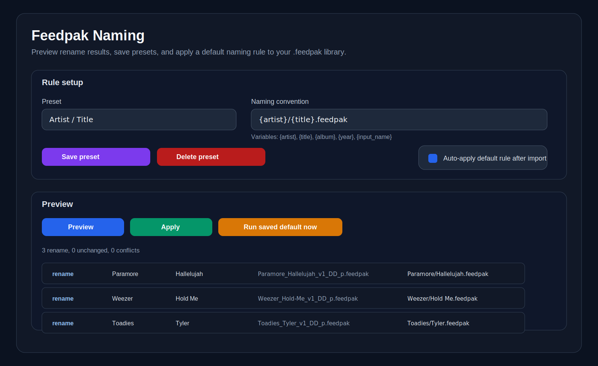

# Feedpak Naming Plugin

Current release: `v0.1.6`

A Feedback plugin for previewing and applying naming rules to `.feedpak` and legacy `.sloppak` files.

## At a glance
- preview rename results before changing anything
- pick exactly which preview rows should be applied
- use variables like `{artist}`, `{title}`, `{album}`, `{year}`, `{input_name}`
- create flat filenames like `{artist}_{title}.feedpak`
- create artist/title folder layouts like `{artist}/{title}.feedpak`
- save reusable presets
- choose duplicate handling: **Stop on conflicts**, **Auto-number duplicates**, or **Skip conflicting rows**
- preview and apply use the **current duplicate-handling dropdown immediately**, without requiring **Save defaults** first
- store a default rule and optionally run it later from one backend route
- scans the whole DLC root so it matches what Feedback's Song Library sees
- includes both `.feedpak` and legacy `.sloppak` packages in preview/apply
- excludes Feedback built-in starter/tutorial/diagnostic content by default, with an advanced opt-in checkbox when you do want those included

## Demo
### Example flow
1. Open the **Naming** plugin in Feedback.
2. Pick a preset or type a rule such as `{artist}/{title}.feedpak`.
3. Choose how duplicate target names should be handled:
   - **Stop on conflicts** → block the batch if selected rows still conflict
   - **Auto-number duplicates** → keep going and rename collisions like `(2)`, `(3)`, etc.
   - **Skip conflicting rows** → keep going, but leave conflicting rows untouched
4. Click **Preview** to see current name → new name for every supported package.
5. Leave checked only the rows you want to rename.
6. Click **Apply selected**.
7. Optional: save that rule as the default and use **Run saved default now** later.

### Screenshot


### Example rename results
- `Paramore_Hallelujah_v1_DD_p.feedpak` → `Paramore/Hallelujah.feedpak`
- `Weezer_Hold-Me_v1_DD_p.feedpak` → `Weezer/Hold Me.feedpak`
- `classic-pack.sloppak` → `Classic Artist/Classic Song.feedpak`

## Install
### Direct clone / copy into Feedback plugins
Clone or copy this repo directly into Feedback's `plugins` folder. Because `plugin.json` now lives at the repo root, the repo folder itself is the plugin folder.

Expected shape:

```text
<feedback-root>/plugins/feedpak-naming-plugin/plugin.json
```

Then reload or restart Feedback and open **Naming**.

### Release zip install
1. Download the release zip.
2. Extract it into your Feedback `plugins` folder.
3. Confirm you end up with this exact shape:

```text
<feedback-root>/plugins/feedpak-naming-plugin/plugin.json
```

4. Reload or restart Feedback.
5. Open the **Naming** plugin inside Feedback.

## Plugin folder contents
```text
feedpak-naming-plugin/
  plugin.json
  routes.py
  screen.html
  screen.js
```

## Template variables
- `{artist}`
- `{title}`
- `{album}`
- `{year}`
- `{input_name}`

## Example templates
- `{artist}_{title}.feedpak`
- `{title}_{artist}.feedpak`
- `{artist}/{title}.feedpak`
- `{year}_{artist}_{title}.feedpak`

## Behavior notes
- The plugin scans the whole DLC root, not just `sloppak/`, so it lines up with Song Library.
- The plugin includes both `.feedpak` and `.sloppak` files in preview and apply.
- Feedback built-in content (`starter/`, `tutorials-builtin/`, `diagnostics-builtin/`) is excluded from preview/apply by default.
- Use **Include Feedback built-in content** if you want preview/apply to include those built-in packages.
- Renamed output still uses the modern `.feedpak` extension by default.
- The plugin only creates subfolders when your template includes `/`.
- Preview rows are selectable; unchecked rows are excluded from apply.
- **Preview** and **Apply selected** use the currently visible duplicate-handling mode immediately, even if you have not clicked **Save defaults**.
- If you change the naming rule, preset, duplicate handling, or built-in-content checkbox after previewing, the plugin marks the preview stale so you know to run **Preview** again.
- **Stop on conflicts** blocks the batch if the currently selected rows still conflict.
- **Auto-number duplicates** resolves collisions by choosing the next available numbered filename such as `(2)`.
- **Skip conflicting rows** continues with ready rows and leaves conflicting rows untouched; preview labels those rows as **skipped**.
- The preview blocks apply only when the currently selected rows still conflict and you are using **Stop on conflicts**.
- Saved defaults and presets are stored by the plugin backend in Feedback's config area.
- The backend exposes a default-run route for future import/conversion hookups.

## Sidebar / menu note
This plugin already declares a `nav` entry in `plugin.json`, so it is eligible for Feedback's plugin menu/sidebar system.

A true user-facing **show/hide this plugin in the sidebar** checkbox is **not** implemented in this standalone plugin yet, because that behavior depends on how the Feedback host builds and filters its sidebar from `/api/plugins`. That needs a small host-side hook rather than a fake local checkbox inside the plugin.

## Repo layout
```text
feedpak-naming-plugin/
  README.md
  LICENSE
  assets/
    demo-preview.svg
  plugin.json
  routes.py
  screen.html
  screen.js
  tests/
    test_feedpak_naming_plugin.py
    preview-state.test.mjs
```

## Development verification
Verified with:
- `pytest tests/test_feedpak_naming_plugin.py -q`
- `node --test tests/preview-state.test.mjs`
- `python -m py_compile routes.py`
- `node --check screen.js`
